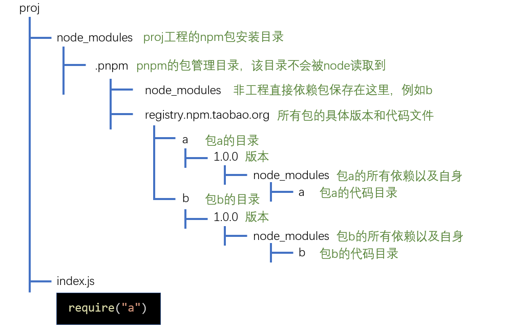

> 该文件是对 Nodejs/1-20/11-npm初体验-格式化时间.js 的补充

# 概述

基础概念：

- 模块（module）：通常以单个文件形式存在的功能片段，入口文件通常称之为**入口模块**或**主模块**
- 库（library，简称 lib）：由一个或多个模块组成的完整功能块，为开发中某一方面的问题提供完整的解决方案
- 包（package）：包含元数据的库，这些元数据包括：名称、描述、github 主页、许可证协议、作者、依赖等等


前端包管理器：

- npm
- yarn
- cnpm
- pnpm
- ...

几乎可以这样认为，前端所有的包管理器都是基于 npm 的，目前，npm 既是一个包管理器，也是其他包管理器的基石

> npm 运行在 node 环境，而不是浏览器环境。因为浏览器环境无法提供下载、删除、读取本地文件的功能，而 node 属于服务器环境，没有浏览器的种种限制，理论上可以完全掌控运行 node 的计算机

# npm

## 包的安装

本地安装：

- 本地安装适用于绝大部分的包，它会在当前目录及其子目录中发挥作用
- 如果本地安装的包带有 CLI，npm 会将它的 CLI 脚本文件放置到 `node_modules/.bin` 目录下，使用命令 `npx 命令名` 即可调用

全局安装：

> **全局安装某一个包的目的并不是希望在所有工程中都可以使用这个包，而仅仅是使用这个包提供的全局 CLI 工具（命令）**

大部分情况下，都不需要全局安装包，除非：

1. 包的版本非常稳定，很少有大的更新
2. 提供的 CLI 工具在各个工程中使用的非常频繁
3. CLI 工具仅为开发环境提供支持，而非部署环境（生产环境）

## 包的配置

npm 将每个使用 npm 的工程本身都看作是一个包，包的信息需要通过一个固定的配置文件来描述

配置文件的名称固定为：package.json。可以手动创建该文件，然而更多时候，是通过命令 `npm init` 自动创建的

> 使用 `npm init --yes` 或 `npm init -y` 可以在生成配置文件时自动填充默认配置

配置文件中可以描述大量的信息，包括：

- name：包的名称，该名称**必须是英文单词字符**，支持连接符
- version：版本
  - 版本规范：主版本号.次版本号.补丁版本号
  - 主版本号：仅当程序发生了重大变化时才会增长，如新增了重要功能、新增了大量的 API、技术架构发生了重大变化
  - 次版本号：仅当程序发生了一些小变化时才会增长，如新增了一些小功能、新增了一些辅助型的 API
  - 补丁版本号：仅当解决了一些 bug 或进行了一些局部优化时才会增长，如修复了某个函数的 bug、提升了某个函数的运行效率
- description：包的描述
- homepage：官网地址
- author：包的作者，必须是有效的 npm 账户名，书写规范是 `account <mail>`，例如：`zhangsan <zhangsan@gmail.com>`。不正确的账号和邮箱可能导致发布包时失败
- repository：包的仓储地址，通常指 git 或 svn 的地址，它是一个对象
  - type：仓储类型，git 或 svn
  - url：仓储地址
- main：包的入口文件，使用该包时，默认从入口文件导入包的内容
- keywords：搜索关键词，发布包后，可以通过该数组中的关键词搜索到该包
- dependencies：生产环境的依赖包
- devDependencies：开发环境的依赖包
- ...

>  大部分时候，我们仅仅是开发项目，并不会把它打包发布出去。尽管如此，我们仍然需要 package.json 文件。因为该文件一个非常重要的作用是使用 dependencies 和 devDependencies 节点记录当前工程的依赖

```shell
# 安装依赖到生产环境
npm i 包名
npm i --save 包名
npm i -S 包名

# 安装依赖到开发环境
npm i --save-dev 包名
npm i -D 包名

# 本地安装所有依赖 dependencies + devDependencies
npm install
npm i

# 仅安装生产环境的依赖 dependencies
npm install --production
npm i --production
```

> 早期，使用命令 `npm i 包名` 只会下载包到 node_modules 目录，并不会记录到 package.json 文件的 dependencies 节点中，需要加上参数 --save（简写 -S）。现在已不存在这个问题，使用 `npm i 包名` 命令安装包时，会自动将其记录到 dependencies 节点

## 语义版本

> 思考：如果你编写了一个包A，依赖另外一个包B，你在编写代码时，包B的版本是2.4.1，你是希望使用你包的人一定要安装包B的2.4.1版本，还是希望他可以安装更高版本的包B？如果你希望他可以安装更高的版本，具体又能高到什么程度呢？

有的时候，我们希望：安装依赖包的时候，次版本号和补丁版本号是可以有提升的，但是主版本号不能变化；有的时候，我们又希望：安装依赖包的时候，只有补丁版本号可以提升，其他都不能变化；有的时候，甚至我们还可能希望依赖包保持固定的版本，尽管这比较少见

这样一来，就需要在配置文件中描述清楚具体的依赖规则，而不是直接写上版本号那么简单。这就是语义版本所要解决的问题。语义版本的书写规则非常丰富，下面列出了一些常见的书写方式：

| 符号 |           描述           |     示例      |                           示例描述                           |
| :--: | :----------------------: | :-----------: | :----------------------------------------------------------: |
|  >   |       大于某个版本       |    \>1.2.1    |                        大于1.2.1版本                         |
|  >=  |     大于等于某个版本     |   \>=1.2.1    |                      大于等于1.2.1版本                       |
|  <   |       小于某个版本       |    <1.2.1     |                        小于1.2.1版本                         |
|  <=  |     小于等于某个版本     |    <=1.2.1    |                      小于等于1.2.1版本                       |
|  -   |     介于两个版本之间     | 1.2.1 - 1.4.5 |                 介于1.2.1版本和1.4.5版本之间                 |
|  x   |      不固定的版本号      |     1.3.x     |             只要保证主版本号是1，次版本号是3即可             |
|  ~   |      补丁版本号可增      |    ~1.3.4     |    保证主版本号是1，次版本号是3，补丁版本号可以大于等于4     |
|  ^   | 次版本号和补丁版本号可增 |    ^1.3.4     | 保证主版本号是1，次版本号可以大于等于3，补丁版本号可以大于等于4 |
|  *   |         最新版本         |       *       |                       始终安装最新版本                       |

### 避免还原的差异

版本依赖控制始终是一个两难的问题。如果允许版本增加，可以带来一些意外的惊喜，但同样可能带来不确定的风险。如果不允许版本增加，可以获得最好的稳定性，但失去了依赖包自我优化的能力。而有的时候情况更加复杂，如果依赖包升级后，依赖包的依赖也发生了变化，会有更多不确定的情况出现

基于此，npm 在安装包的时候，会自动生成一个 package-lock.json 文件，该文件记录了安装包时的确切依赖关系。移植工程时，如果移植了 package-lock.json 文件，恢复依赖时，会按照 package-lock.json 文件中的确切依赖进行安装，最大程度的避免了差异

### [扩展] npm 的差异版本处理

如果两个包依赖同一个包的不同版本，如下图：


npm 在面临这种情况时，在 node_modules 目录中，不会使用扁平的目录结构，而会形成嵌套的目录，如下图：

```
├── node_modules
│   ├── a
│   │   ├── node_modules
│   │   │   ├── c
│   │   │   |   |—— c包的文件
│   │   │── a包的文件
│   ├── b
│   │   ├── node_modules
│   │   │   ├── c
│   │   │   |   |—— c包的文件
│   │   │── b包的文件
```

## npm 脚本

在开发的过程中，我们可能会反复使用很多的 CLI 命令，例如：

1. 启动工程命令（node 或一些第三方包提供的 CLI 命令）
2. 部署工程命令（一些第三方包提供的 CLI 命令）
3. 测试工程命令（一些第三方包提供的 CLI 命令）

这些命令纷繁复杂，根据第三方包的不同命令也会不一样，非常难以记忆。于是，npm 非常贴心的支持了脚本，只需要在 package.json 中配置 scripts 字段，即可配置各种脚本。之后，我们就可以通过运行简单的指令来完成各种操作了。运行方式是：`npm run 脚本名称`

> 对一些常见的脚本名称，npm 对其进行了简化。运行时不需要使用 run，直接 `npm 脚本名称`。可以简化的脚本名称有：start、restart、stop、test

一些细节：

1. 在脚本中，可以省略 npx
2. start 脚本有默认值。若 scripts 中没有 start 脚本，那么运行 `npm start` 或者 `npm run start` 时，默认运行 `node server.js`

## 运行环境配置

我们书写的代码一般有三种运行环境：

1. 开发环境（development）
2. 生产环境（production）
3. 测试环境（test）

有的时候，我们可能需要在 node 代码中根据不同的环境做出不同的处理。如何优雅的让 node 知道当前处于什么环境，是极其重要的。通常我们使用这种处理方式：

node 中有一个全局 global 对象，该对象中的所有属性均可以直接使用。其中有一个属性 process，值是一个对象，包含了当前运行 node 程序的计算机的很多信息，其中有一个信息 env（`global.process.env`），是一个对象，包含了计算机中所有的系统变量。通常，我们通过系统变量 `NODE_ENV` 的值，来判定 node 程序当前处于何种环境。

有两种方式设置 `NODE_ENV` 的值（以 Windows 操作系统为例）：

1. 永久设置（不推荐）

   右键我的电脑选择属性 -> 高级系统设置 -> 环境变量 -> 新建系统变量（变量名通常为 NODE_ENV，变量值通常为 development 或者 production 或者 test）

2. 临时设置（推荐）

   在项目的 package.json 文件中书写 npm 脚本：

   ```json
   {
       "scripts": {
           "start": "set NODE_ENV=development&&node index.js",
           "build": "set NODE_ENV=production&&node index.js",
           "test": "set NODE_ENV=test&&node index.js"
       }
   }
   ```

   > `set xxx=yyy` 是 windows 操作系统下设置环境变量的写法，其他操作系统有所不同

   为了避免不同操作系统下设置方式的差异，可以使用第三方库 cross-env 对环境变量进行设置：

   ```shell
   npm i cross-env -D
   ```

   ```json
   {
       "scripts": {
           "start": "cross-env NODE_ENV=development node index.js",
           "build": "cross-env NODE_ENV=production node index.js",
           "test": "cross-env NODE_ENV=test node index.js"
       }
   }
   ```

### 在 node 中读取 package.json

有的时候，我们可能会在 package.json 中配置一些自定义的字段供 node 程序读取，读取的方式如下：

```js
const config = require("./package.json");
console.log(config.xxx)
```

## 其他 npm 命令

### 安装包

1. 精确安装最新版本

   ```shell
   npm install --save-exact 包名
   npm install -E 包名
   ```

2. 安装指定版本

   ```shell
   npm install 包名@版本号
   ```

### 查询包

1. 查询包的（全局）安装路径

   ```shell
   npm root [-g]
   ```

2. 查看包信息

   ```shell
   npm view 包名 [子信息]
   # view aliases：v、info、show
   ```

3. 查询已安装的（全局）包

   ```shell
   npm list [-g] [--depth=依赖深度]
   # list aliases：ls、la、ll
   ```

### 更新包

1. 检查有哪些包需要更新

   ```shell
   npm outdated
   ```

2. 更新（全局）包

   ```shell
   npm update [-g] [包名]
   # update aliases：up、upgrade
   ```

   > 如何更新 npm 本身？
   >
   > 答：安装 node 时，会自动安装 npm。之后若想更新 npm，我们可以直接用当前版本（旧版本）的 npm 全局安装最新版本的 npm，即 `npm install npm -g`。安装完成后，使用的 npm 命令就是最新版本的 npm 命令了。后续，若 npm 版本有更新，又需要更新 npm，直接全局更新 npm 即可，即 `npm update npm -g`

### 卸载包

```shell
npm uninstall [-g] 包名
# uninstall aliases：remove、rm、r、un、unlink
```

### npm 配置

npm 的配置会对其他命令产生或多或少的影响。安装好 npm 之后，会产生两个配置文件，一个是用户配置，一个是系统配置，当两个文件的配置项有冲突的时候，用户配置的优先级更高

1. 查询目前生效的各种配置

   ```shell
   npm config ls [-l] [--json]
   # -l表示以列表形式显示，--json表示以json格式显示
   ```

2. 获取某个配置项

   ```shell
   npm config get 配置项
   ```

3. 设置某个配置项

   ```shell
   npm config set 配置项=值
   ```

4. 移除某个配置项

   ```shell
   npm config delete 配置项
   ```

# yarn

## 简介

> yarn 官网：https://yarnpkg.com/

yarn 是由 Facebook、Google、Exponent 和 Tilde 联合推出的一个新的 JS 包管理工具，**它仍然使用 npm 的 registry**，不过提供了全新的 CLI 对包进行管理

过去，npm 存在以下问题：

1. 依赖嵌套：过去，npm 的依赖是嵌套的，这在 windows 系统上是一个极大的问题。因为 windows 系统无法支持太深的目录（目录路径长度不能超过256个字符）
2. 下载速度慢：由于 npm 的依赖是嵌套的，所以下载包时只能串行下载，即前一个包下载完后才会下载下一个包，导致带宽资源没有完全利用。并且多个相同版本的包还会被重复的下载
3. 控制台输出繁杂：过去，npm 安装包的时候，每安装一个依赖，就会输出依赖的详细信息，导致一次安装有大量的信息输出到控制台，遇到错误极难查看
4. 工程移植问题：由于 npm 的版本依赖可以是模糊的，可能会导致工程移植后，依赖的确切版本不一致

针对上述问题，yarn 从诞生那天就已经解决，它用到了如下的手段：

1. 使用扁平的目录结构
2. 并行下载
3. 使用本地缓存
4. 控制台仅输出关键信息
5. 使用 yarn.lock 文件记录确切依赖

不仅如此，yarn 还优化了以下内容：

1. 增加了某些功能强大的命令
2. 让既有的命令更加语义化
3. 本地安装的 CLI 工具可以使用 yarn 直接启动
4. 将全局安装的目录当作一个普通的工程，生成 package.json 文件，便于全局安装移植

## yarn 的核心命令

1. 初始化：`yarn init [--yes/-y]`

2. 安装：`yarn [global] add 包名[@版本号] [--dev/-D] [--exact/-E]`

   > 安装所有依赖：`yarn install`
   >
   > 仅安装生产环境的依赖：`yarn install [--production/--prod]`

3. 查询

   - 查看本地（全局）安装的包的可执行文件的存放位置：`yarn [global] bin`

   - 查看包信息：`yarn info 包名 [子信息]`

   - 列举已安装的（全局）依赖：`yarn [global] list [--depth=依赖深度]`

     > yarn 的 list 命令和 npm 的 list 不同，yarn 输出的信息更加丰富，包括顶级目录结构、每个包的依赖版本号

4. 更新

   - 检查有哪些包需要更新：`yarn outdated`
   - 更新包：`yarn [global] upgrade [包名]`

5. 卸载：`yarn [global] remove 包名`

6. 脚本和本地 CLI

   - 运行脚本：`yarn run 脚本名`

     > start、restart、stop、test 可以省略 run

   - 运行本地安装的 CLI：`yarn run CLI名`

## yarn 的特别礼物

在终端命令上，yarn 不仅仅是对 npm 的命令做了一个改名，还增加了一些原本没有的命令，这些命令在某些时候使用起来非常方便

1. `yarn check`：验证 package.json 文件的依赖记录和 yarn.lock 文件是否一致，这对于防止篡改非常有用

2. `yarn audit`：检查本地安装的包有哪些已知漏洞，以表格的形式列出，漏洞级别分为以下几种：

   - INFO：信息级别
   - LOW：低级别
   - MODERATE：中级别
   - HIGH：高级别
   - CRITICAL：关键级别

3. `yarn why`：使用 `yarn why 包名` 命令，可以在控制台打印出为什么安装了这个包，哪些包会用到它

4. `yarn create`：我们通常会使用脚手架来搭建工程结构，分为两步：1）全局安装脚手架工具；2）使用脚手架提供的命令搭建工程

   由于大部分脚手架工具都是以 `create-xxx` 的形式命名的，比如 react 的官方脚手架名称为 `create-react-app`，因此，可以使用 `yarn create` 命令来一步完成安装和搭建：

   ```shell
   yarn create react-app my-app
   # 等同于下面的两条命令
   yarn global add create-react-app
   create-react-app my-app
   ```

# pnpm

相比较于 npm 和 yarn，pnpm 有如下优势：

1. 安装效率更高
2. 极其简洁的 node_modules 目录
3. **避免了开发时可以使用间接依赖的问题**
4. 能极大的降低磁盘空间的占用

安装和使用：

全局安装 pnpm：`npm i -g pnpm`，之后在使用时，只需要把 npm 替换为 pnpm 即可。如果要执行安装在本地的 CLI，可以使用 pnpx，它和 npx 的功能完全一样，唯一不同的是，在使用 pnpx 执行一个尚未安装的 CLI 时，会使用 pnpm 将其临时安装在内存中

pnpm 原理：

1. 同 npm 和 yarn 一样，pnpm 仍然使用缓存来保存已经安装过的包，以及使用 pnpm-lock.yaml 文件来记录详细的依赖版本

2. 不同于 npm 和 yarn，pnpm 使用**符号链接和硬链接**的做法来放置依赖，从而规避了从缓存中拷贝文件的时间，使得安装和卸载的速度更快

3. 由于使用了符号链接和硬链接，pnpm 可以规避 windows 操作系统路径过长的问题

4. pnpm 选择使用树形的依赖结果，因此，项目中只能使用直接依赖，而不能使用间接依赖

   > 注意：正因如此，如果 pnpm 安装的包中使用了间接依赖，则会出现问题（这并不是 pnpm 的问题，而是书写包的人没有规范书写代码）（现在这个问题已被 pnpm 解决，见下文的 pnpm 原理）

## [扩展] pnpm 原理

### 前置知识

1.**文件的本质**

在操作系统中，文件实际上是一个指针，只不过它指向的不是内存地址，而是一个外部存储地址（这里的外部存储可以是硬盘、U盘、甚至可以是网络）


当我们删除文件时，删除的实际上是指针。因此，无论删除多么大的文件，速度都非常快


2.**文件的拷贝**

复制一个文件时，是将该文件指针指向的内容进行复制，然后产生一个新文件指向新的内容


3.**硬链接**

硬链接的概念来自于 Unix 操作系统，它是指将一个文件 A 指针复制到另一个文件 B 指针中，文件 B 就是文件 A 的硬链接


通过硬链接，两个文件指向相同的磁盘内容，几乎不会产生额外的磁盘占用

硬链接的数量没有限制，可以为同一个文件产生多个硬链接

从 windows Vista 操作系统开始，支持创建硬链接的操作，在 cmd 中使用如下命令创建硬链接（不能使用 powershell）：

```shell
mklink /h 链接名称 目标文件
# 例如：mklink /h demo.txt temp\article.txt
```

> 注意：
>
> 1. 由于文件夹（目录）不存在文件内容，所以文件夹（目录）不能创建硬链接
> 2. 由于种种原因，在 windows 操作系统中，通常不能跨越盘符创建硬链接

4.**符号链接**

符号链接又称为软链接，如果为某个文件或文件夹 A 创建符号链接 B，则 B 指向 A


从 windows Vista 操作系统开始，支持创建符号链接的操作，在 cmd 中使用如下命令创建符号链接（不能使用 powershell）：

```shell
mklink /d 链接名称 目标文件或目录
# 例如：mklink /d demo temp\sub
# tip：/d 表示创建的是目录的符号链接，不写则是文件的符号链接
```

5.**硬链接与符号链接的区别**

- 硬链接仅能链接文件，而符号链接可以链接目录
- 硬链接在链接完成后仅和文件内容关联，和之前链接的文件没有任何关系。而符号链接始终和之前链接的文件关联，和文件内容不直接相关

6.**快捷方式**

快捷方式类似于符号链接，是 windows 系统早期就支持的链接方式。它不仅仅是一个指向其他文件或目录的指针，其中还包含了其他各种信息：如权限、兼容性启动方式等

> 由于快捷方式是 windows 系统独有的，所以在跨平台的应用中一般不会使用

7.**node 环境对硬链接和符号链接的处理**

- 硬链接：硬链接是一个实实在在的文件，node 不对其做任何特殊处理，也不会区别对待。实际上，node 根本无从知晓该文件是不是一个硬链接
- 符号链接：由于符号链接指向的是另一个文件或目录，当 node 执行符号链接下的 JS 文件时，会使用原始路径。例如：`src/a.js` 文件是 `src/sub/b.js` 文件的符号链接，运行 `node src/a.js` 时，`__dirname` 是 `b.js` 所处的目录，而不是 `a.js` 所处的目录

### pnpm 原理

pnpm 使用硬链接和符号链接来构建 node_modules 目录，下面用一个例子来说明它的构建方式，假设有两个包，a 和 b，a 依赖 b


假设我们的工程为 proj，直接依赖 a，则安装依赖时，pnpm 会做以下处理：

1.查询依赖关系，得到最终要安装的包：a 和 b

2.查看 a 和 b 是否已经有缓存，如果没有，下载到缓存中，如果有，则进入下一步

3.创建 node_modules 目录，并对目录进行结构初始化



4.从缓存的对应包中使用硬链接放置文件到相应包代码目录中


5.使用符号链接，将每个包的**直接依赖**放置到自己的目录中


>  这样做的目的，是为了保证包 a 的代码在执行过程中，可以读取到它的直接依赖包 b

6.新版本的 pnpm 为了解决一些书写不规范的包（读取间接依赖）的问题，又将工程的所有非直接依赖，使用符号链接加入到了 `.pnpm/node_modules` 目录中。由于本例中包 a 没有读取间接依赖，所以这一步没有必要，但是如果 b 依赖 c，a 又要直接用 c，那么这种不规范的写法就需要 pnpm 通过这种方式支持了

> 但对于那些使用诸如 `require('./node_modules/a/index.js')` 这种路径的奇葩写法，可能永远也无法支持

7.在工程的 node_modules 目录中使用符号链接，放置直接依赖


8.完成