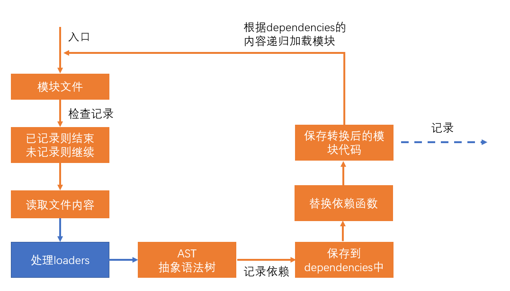

# loader

> webpack做的事情，仅仅是分析出各种模块的依赖关系，然后形成资源列表，最终打包生成到指定的文件中。
> 更多的功能需要借助webpack loaders和webpack plugins完成。

webpack loader： loader本质上是一个函数，它的作用是将某个源码字符串转换成另一个源码字符串返回。


loader函数将在模块解析的过程中被调用，以得到最终的源码。

**全流程：**


**chunk中解析模块的流程：**


**chunk中解析模块的更详细流程：**



**处理loaders流程：**


**loader配置：**

**完整配置**

```js
module.exports = {
    module: { // 针对模块的配置，可配置项有rules、noParse等
        rules: [ // 模块匹配规则，可以存在多个规则
            { // 每个规则是一个对象
                test: /\.js$/, // 正则表达式，匹配模块的路径
                use: [ // 匹配成功后需要应用的loader
                    {   // 其中一个loader
                        loader: "模块路径", // loader的路径，该字符串会被放置到require函数中
                        options: { // 向对应loader传递的额外参数

                        }
                    }
                ]
            }
        ]
    }
}
```

**简化配置**

```js
module.exports = {
    module: { // 针对模块的配置，可配置项有rules、noParse等
        rules: [ // 模块匹配规则，可以存在多个规则
            { // 每个规则是一个对象
                test: /\.js$/, // 正则表达式，匹配模块的路径
                use: ["模块路径1", "模块路径2"] // loader的路径，该字符串会被放置到require函数中
            }
        ]
    }
}
```

# loader 使用示例

```js
// src/loaders/test-loader.js
// 用于处理webpack loaders的一个工具包（需先安装：npm i -D loader-utils，本例中的版本：2.0.4）
const loaderUtils = require('loader-utils');

module.exports = function(sourceCode){
  // 参数sourceCode就是输入的源码字符串
  // 函数的返回值就是将源码字符串转化后的输出结果
  // 读取向该loader传递的参数
  const { a, b } = loaderUtils.getOptions(this);
  console.log(a, b); // 1, 2
  return sourceCode;
}
```

```js
// webpack.config.js
module.exports = {
  module: {
    rules: [
      {
        test: /index\.js$/,
        use: [
          {
            loader: './src/loaders/test-loader',
            options: {
              a: 1,
              b: 2
            }
          }
        ]
      }
    ]
  }
}
```

# loader 运行顺序

```js
// 各种loaders
// src/loaders/loader1.js
module.exports = function(sourceCode){
  console.log('loader1');
  return sourceCode;
}

// src/loaders/loader2.js
module.exports = function(sourceCode){
  console.log('loader2');
  return sourceCode;
}

// src/loaders/loader3.js
module.exports = function(sourceCode){
  console.log('loader3');
  return sourceCode;
}

// src/loaders/loader4.js
module.exports = function(sourceCode){
  console.log('loader4');
  return sourceCode;
}
```

```js
// webpack.config.js
module.exports = {
  module: {
    rules: [
      {
        test: /index\.js$/,
        use: ['./src/loaders/loader1', './src/loaders/loader2']
      },
      {
        test: /\.js$/,
        use: ['./src/loaders/loader3', './src/loaders/loader4']
      }
    ]
  }
}
```

输出结果：loader4	loader3	loader2	loader1

# 常用 loader

- file-loader：将文件（如图片、字体）输出到 output 目录并返回最终路径
- url-loader：与 file-loader 类似，但如果文件大小小于某个临界值，则可以转换为 base64 以减少 HTTP 请求
- ...etc