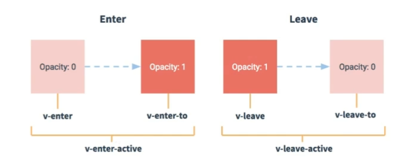

# 笔记

## Vue脚手架(vue-cli)使用流程
Vue脚手架是Vue官方提供的标准化开发工具，其使用步骤如下：
1. 全局安装vue/cli
```
npm install -g @vue/cli
```
2. 切换到要创建项目的目录，然后运行如下命令
```
vue create 项目名称
```
3. 进入项目根目录，然后启动项目
```
cd 项目名称
npm run serve
```

## 脚手架文件结构
```
├── node_modules 
├── public
│   ├── favicon.ico: 页签图标
│   └── index.html: 主页面
├── src
│   ├── assets: 存放静态资源，例如图片、视频等
│   │   └── logo.png
│   │── component: 存放组件
│   │   └── HelloWorld.vue
│   │── App.vue: 汇总所有组件
│   │── main.js: 入口文件
├── .gitignore: git版本管制忽略的配置
├── babel.config.js: babel的配置文件
├── package.json: 应用包配置文件 
├── README.md: 应用描述文件
├── package-lock.json：包版本控制文件
```

## 关于不同版本的Vue
- vue.js与vue.runtime.xxx.js的区别：
    1. vue.js是完整版的Vue，包含：核心功能 + 模板解析器
    2. vue.runtime.xxx.js是运行版的Vue，只包含核心功能，没有模板解析器
- 因为vue.runtime.xxx.js没有模板解析器，所以不能使用template这个配置项，需要使用render函数接收到的createElement函数去指定具体内容

## vue.config.js配置文件
> 运行 `vue inspect > output.js` 命令可以查看到Vue脚手架的默认配置
> `vue.config.js` 文件可以对脚手架进行个性化定制

## ref属性
* 被用来给元素或子组件注册引用信息（id的替代者）
* 应用在html标签上获取的是真实DOM元素，应用在组件标签上是获取的是组件实例对象（vc）
* 使用方式
    ```
    // 打标识
    <h1 ref="xxx"></h1>或<School ref="xxx"></School>
    // 获取
    this.$refs.xxx
    ```

## 配置项props
    功能：让组件接收外部传过来的数据
    注意：接收到的数据（包括属性和方法）最终都会出现在组件实例对象vc上
    (1)传递数据：
        <Demo name="xxx" />
    (2)接收数据：
        第一种方式（只接收）：
            props:['name']
        第二种方式（限制类型）：
            props:{
                name:String
            }
        第三种方式（限制类型、限制必要性、指定默认值）
            props:{
                name:{
                    type: String,
                    required: true,
                    default: '老王'
                }
            }
备注：props是只读的，Vue底层会监测对props的修改，如果进行了修改，就会发出警告，若业务需求确实需要修改，那么请复制props的内容到data中一份，然后去修改data中的数据

## mixin（混入）
    功能：可以把多个组件共用的配置提取成一个混入对象
    使用方式：
        第一步定义混入，例如：
            {
                data(){...},
                methods:{...}
                ...
            }
        第二步使用混入（先使用import引入）：
            （1）全局混入：Vue.mixin(xxx)
            （2）局部混入：mixins:[xxx]（配置项）

## 插件plugins
    功能：用于增强Vue
    本质：包含install方法的一个对象，install的第一个参数是Vue，第二个及以后的参数是插件使用者传递的数据
    定义插件：
    	export default {
    		install(Vue[, param1][, param2][...]){
    			// 1. 添加全局过滤器
    			Vue.filter(...)
    			// 2. 添加全局指令
    			Vue.directive(...)
    			// 3. 配置全局混入（合）
    			Vue.mixin(...)
    			// 4. 往Vue原型上添加属性和方法
    			Vue.prototype.$myMethod = function(){...}
    			Vue.prototype.$myProperty = xxx
    			...
    		}
    	}
    使用插件：
    	import xxx from ...
    	Vue.use(xxx) // 还可以传递其他自定义参数

## scoped样式
    作用：让样式在局部生效，防止冲突
    写法：<style scoped lang="less"></style>
    备注：
      1. 一般不在App组件的style标签内书写scoped属性，因为在App组件里书写的CSS样式一般来说都是全局样式
      2. 在style标签内还可以使用lang属性指定CSS语言，但是需要安装对应的loader（例如less和less-loader）

## 总结TodoList案例
1. 组件化编码流程(关闭语法检查（修改vue.config.js文件后需要npm run serve重启项目），安装全局事件总线)：
    - 拆分静态组件：组件要按功能点拆分，命名不要与html元素冲突
    - 实现动态组件：考虑好数据的存放位置，数据是一个组件在用，还是一些组件在用
        - 一个组件在用：放在组件自身即可
        - 一些组件在用：放在它们共同的父组件上（状态提升）
    - 实现交互：从绑定事件监听开始
2. props适用于：
    - 父组件==>子组件 通信
    - 子组件==>父组件 通信（要求父先给子一个函数）
3. 使用v-model时要切记：v-model绑定的值不能是props传过来的值，因为props是不可以修改的
4. props传过来的若是对象类型的值，修改对象中的属性时Vue不会报错，但不推荐这样做

## webStorage
1. 存储内容大小一般支持5MB左右（不同浏览器可能还不一样）
2. 浏览器端通过`window.sessionStorage`和`window.localStorage`属性来实现本地存储机制
3. 相关API：
    1. `xxxStorage.setItem('key',value)`
        该方法接受一个键和值作为参数，会把键值对添加到存储中，如果键名存在，则更新对应的值
    2. `xxxStorage.getItem('key')`
        该方法接受一个键名作为参数，返回键名对应的值
    3. `xxxStorage.removeItem('key')`
        该方法接受一个键名作为参数，并把该键名对应的键值对从存储中删除
    4. `xxxStorage.clear()`
        该方法会清空存储中的所有数据
4. 备注：
    1. sessionStorage存储的内容会随着对应浏览器标签或窗口的关闭而消失
    2. localStorage存储的内容，需要手动清除才会消失
    3. 通过xxxStorage存储的键值，浏览器会将它们转换为字符串类型
    4. 要想在浏览器的本地存储和会话存储中保存和读取对象或数组，可以调用`JSON.stringify()`和`JSON.parse()`方法
    5. `xxxStorage.getItem(xxx)`如果xxx对应的value获取不到，那么返回null
    6. `JSON.parse(null)`的结果依然是null

## 组件自定义事件
1. 一种组件间通信的方式，适用于子组件==>父组件
2. 使用场景：A是父组件，B是子组件，B想给A传数据，那么就要在A中给B绑定自定义事件（事件的回调在A中）
3. 绑定自定义事件
    1. 第一种方式，在父组件中：`<Demo @atguigu="callback"/>`或`<Demo v-on:atguigu="callback"/>`
    2. 第二种方式，在父组件中：
    ```
    <Demo ref="demo">
    mounted(){
        this.$refs.demo.$on('atguigu',callback)
    }
    ```
    3. 若想让自定义事件只能触发一次，可以使用如下方式：
       1. <Demo @atguigu.once="callback"/>
       2. this.$refs.demo.$once('atguigu',callback)
4. 触发自定义事件：`this.$emit('atguigu',数据)`
5. 解绑自定义事件：`this.$off('atguigu')`，如果要解绑多个事件，参数就是包含多个事件名的数组，如果不传参数，表示解绑所有的自定义事件
6. 组件上绑定的事件默认是组件自定义事件，但是也可以通过使用native修饰符来绑定原生DOM事件，例如：`<Demo @click.native="callback"/>`
7. 注意：通过`this.$refs.xxx.$on('eventName',callback)`绑定自定义事件时，回调要么配置在methods中，要么使用箭头函数，否则this就不再指向当前的组件实例对象，而是指向触发自定义事件的组件实例对象

## 全局事件总线（GlobalEventBus）
1. 一种组件间通信的方式，适用于任意组件间通信
2. 安装全局事件总线：
```
new Vue({
    beforeCreate(){
        Vue.prototype.$bus = this // 安装全局事件总线，$bus就是当前应用的vm
    }
})
```
3. 使用事件总线：
```
// 接收数据的组件
mounted(){
    this.$bus.$on('eventName', callback)
},
beforeDestroy(){
    this.$bus.$off('eventName') // 最好在beforeDestroy钩子中，用$off去解绑当前组件所用到的事件
}
// 提供数据的组件
this.$bus.$emit('eventName', data)
```

## 消息订阅与发布
1. 一种组件间通信的方式，适用于任意组件间通信
2. 使用步骤
    1. 安装pubsub：`npm i pubsub-js`
    2. 引入：`import pubsub from 'pubsub-js`
    3. 接收数据：A组件想接收数据，则在A组件中订阅消息，订阅的回调留在A组件自身
    ```
    mounted(){
		// 回调函数要么写成箭头函数，要么配置在methods中，否则this不再指向当前组件的组件实例对象，而是undefined
        // 注意：这里的回调函数第一个参数是消息名，后面的参数才是接收到的数据
        this.pubId = pubsub.subscribe('msgName', callback) // 订阅消息
    },
    beforeDestroy(){
        pubsub.unsubscribe(this.pubId) // 最好在beforeDestroy钩子中，对消息取消订阅
    }
    ```
    4. 提供数据：`pubsub.publish('msgName', data) // 发布消息`

## nextTick
1. 语法：this.$nextTick(callbackFn)
2. 作用：在下一次DOM更新结束后执行其指定的回调
3. 什么时候用：当改变数据后，要基于更新后的新DOM进行某些操作时，要在nextTick所指定的回调函数中执行

## Vue封装的过渡与动画
1. 作用：在插入、更新或移除DOM元素时，在合适的时候给元素添加样式类名

2. 图示：

    

3. 写法：
    1. 准备好样式
        - 元素进入的样式：
            1. v-enter：进入的起点
            2. v-enter-active：进入过程中
            3. v-enter-to：进入的终点
        - 元素离开的样式：
            1. v-leave：离开的起点
            2. v-leave-active：离开过程中
            3. v-leave-to：离开的终点
    2. 使用 `<transition>`标签包裹要添加动画的元素（或组件）
    3. 备注：
       1. 如果`<transition>`标签里有多个根元素，则需要将 `<transition>` 换为 `<transition-group>` ，并且为其中的每个根元素指定一个唯一的key值
       2. 可以给`<transition>`标签（或`<transition-group>`标签）添加`appear`属性，表示在首次渲染页面的时候为其中的元素加上动画效果
       3. 如果需要为多个元素添加不同的动画，就需要为每一个`<transition>`标签（或`<transition-group>`标签）配置name属性，且样式类名中所有的v都要替换成name属性值
       4. `<transition>`标签最终不会出现在DOM结构树中
       5. 第三方动画库的使用（以animate.css为例），详见Text3.vue

## 总结
1. 最终出现在vm或vc上的属性或方法
   - 属性：data computed props（属性）
   - 方法：methods props（方法）
2. 组件间通信的方式
    - 父给子传递数据-->父组件通过标签属性的方式给子组件传递数据，子组件需要使用props配置项接收
    - 子给父传递数据-->父组件通过标签属性的方式给子组件传递一个函数，子组件需要使用props配置项接收并在合适的时机调用该函数并携带上要传递给父组件的数据
    - 子给父传递数据-->组件自定义事件，父组件给子组件绑定自定义事件，子组件在合适的时机触发自定义事件
    - 任意组件间通信-->全局事件总线
    - 任意组件间通信-->消息订阅与发布
    - 任意组件间通信-->Vuex（多个组件共享数据）