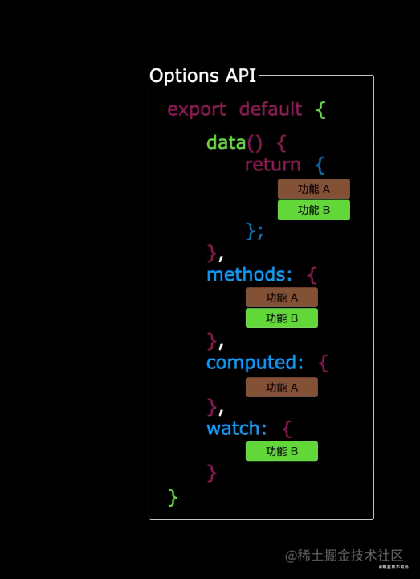

# Vue3核心语法

## setup

1. 理解：Vue3.0中一个新的配置项，值为一个函数。setup是所有Composition API（组合式API）“表演的舞台”，组件中所用到的：数据、方法等等，均要配置在setup中
2. setup执行的时机：在beforeCreate之前执行一次，其中的this是undefined
3. setup的参数：
   - props：值为对象，包含：组件外部传递过来，且组件内部声明接收了的属性
   - context：上下文对象
     - attrs：值为对象，包含：组件外部传递过来，但没有在props配置（或defineProps）中声明的属性，相当于Vue2中的 `this.$attrs`
     - slots：收到的插槽内容，相当于Vue2中的 `this.$slots`
     - emit：触发自定义事件的函数，相当于Vue2中的 `this.$emit`
4. setup函数的两种返回值：
   - 若返回一个对象，则对象中的属性、方法，在模板中均可以直接使用（重点关注！）
   - 若返回一个渲染函数：则可以自定义渲染内容（了解）
5. 注意点：
   - 尽量不要与Vue2.x配置混用
     1. Vue2.x的配置（data、methos、computed...）中可以访问到setup中的属性、方法
     2. 但在setup中不能访问到Vue2.x的配置（data、methos、computed...）
     3. 如果有重名，setup优先
   - setup不能是一个async函数，因为返回值不再是return的对象，而是promise，模板看不到return对象中的属性（后期也可以返回一个Promise实例，但需要Suspense和异步组件的配合）

## setup的语法糖

setup函数有一个语法糖，这个语法糖，可以让我们把setup独立出来，代码如下：

```vue
<script lang="ts">
  export default {
    name: 'Person',
    setup(){
      let name = '张三'
      let age = 18
      let tel = '13888888888'

      function changeName(){
        name = 'zhang-san'
      }
      function changeAge(){
        age += 1
      }
      function showTel(){
        alert(tel)
      }
      
      return {name, age, tel, changeName, changeAge, showTel}
    }
  }
</script>

<!-- 下面的写法是setup语法糖 -->
<script lang="ts">
  export default {
    name: 'Person'
  }
</script>

<script lang="ts" setup>
  let name = '张三'
  let age = 18
  let tel = '13888888888'

  function changeName(){
    name = 'zhang-san'
  }
  function changeAge(){
    age += 1
  }
  function showTel(){
    alert(tel)
  }
</script>
```

扩展：上述代码，还需要编写一个不写setup的script标签去指定组件名字，比较麻烦，我们可以借助vite中的插件简化：

  1. 第一步：`npm i vite-plugin-vue-setup-extend -D`

  2. 第二步：修改`vite.config.ts`文件

     ```typescript
     import VueSetupExtend from 'vite-plugin-vue-setup-extend'
     export default defineConfig({
       plugins: [
         VueSetupExtend()
       ],
     })
     ```

  3. 第三步：在Person组件中就可以只写一个script标签进行简化了

     ```vue
     <script lang="ts" setup name="Person">
       let name = '张三'
       let age = 18
       let tel = '13888888888'
     
       function changeName(){
         name = 'zhang-san'
       }
       function changeAge(){
         age += 1
       }
       function showTel(){
         alert(tel)
       }
     </script>
     ```

## ref函数

- 作用：定义一个响应式的数据
- 语法：`const xxx = ref(initValue)` 
  - 创建一个包含响应式数据的引用对象（reference对象，简称ref对象）
  - JS中操作数据： ```xxx.value```
  - 模板中读取数据：不需要.value，直接：`<div>{{xxx}}</div>`
- 备注：
  - 接收的数据可以是：基本类型、也可以是对象类型
  - 基本类型的数据：响应式依然是靠`Object.defineProperty()`的get与set实现的
  - 对象类型的数据：内部“求助”了Vue3.0中的一个新函数——reactive函数

## reactive函数

- 作用：定义一个对象类型的响应式数据（基本类型不要用它，要用ref函数）
- 语法：`const 代理对象= reactive(源对象)`接收一个对象（或数组），返回一个代理对象（Proxy的实例对象，简称proxy对象）
- 备注：
  1. reactive定义的响应式数据是“深层次的”
  2. reactive内部基于ES6的Proxy实现，通过代理对象操作源对象内部数据进行操作
  3. 使用reactive重新分配一个新对象时，会失去响应式（可以使用Object.assign去整体替换）

```vue
<template>
  <h3>汽车信息：{{car.brand}}--{{car.price}}</h3>
  <button @click="changeCar">点我更换汽车</button>
</template>
<script lang="ts" setup>
  import {reactive} from 'vue'
  let car = reactive({brand: '奔驰', price: 40})
  function changeCar(){
    // car = {brand: '宝马', price: 30} // 会丢失响应式
    // car = reactive({brand: '宝马', price: 30}) // 会丢失响应式
    Object.assign(car, {brand: '宝马', price: 30}) // 不会丢失响应式
  }
</script>
```

## ref和reactive的对比

1. 从定义数据角度对比：
   - ref用来定义：基本类型数据
   - reactive用来定义：对象（或数组）类型数据
   - 备注：ref也可以用来定义对象（或数组）类型数据，它内部会自动通过reactive转为代理对象
   
2. 从原理角度对比：
   - ref通过`Object.defineProperty()`的get与set来实现响应式（数据劫持）
   - reactive通过使用Proxy来实现响应式（数据劫持）, 并通过Reflect操作源对象内部的数据
   
3. 从使用角度对比：
   - ref定义的数据：操作数据需要`.value`，读取数据时模板中直接读取不需要`.value`
   - reactive定义的数据：操作数据与读取数据：均不需要`.value`
   
4. 一个小坑：

   ```vue
   <script lang="ts" name="App" setup>
     import { ref, reactive } from 'vue';
   
     let obj = reactive({
       a: 1,
       b: 2,
       c: ref(3)
     });
     console.log(obj.a); // 1
     console.log(obj.b); // 2
     // 注意：当访问obj.c的时候，底层会自动读取value属性，因为c是在obj这个响应式对象中的，所以不需要.value
     console.log(obj.c); // 3
     console.log(obj.c.value); // undefined
   </script>
   ```

## 响应式原理

### Vue2的响应式

- 实现原理：

  - 对象类型：通过`Object.defineProperty()`对属性的读取、修改进行拦截（数据劫持）

  - 数组类型：通过重写更新数组的一系列方法来实现拦截（对数组的变更方法进行了包裹）

    ```js
    Object.defineProperty(data, 'count', {
      get () {}, 
      set () {}
    })
    ```

- 存在问题：

  - 新增属性、删除属性，界面不会自动更新
  - 直接通过下标修改数组，界面不会自动更新

### Vue3的响应式

- 实现原理：

  - 通过Proxy（代理）:  拦截对象中任意属性的变化，包括：属性值的读写、属性的添加、属性的删除等

  - 通过Reflect（反射）:  对源对象的属性进行操作

    ```js
    new Proxy(srcObj, {
      // 拦截读取属性值
      get (target, prop) {
        return Reflect.get(target, prop)
      },
      // 拦截修改属性值和添加新属性
      set (target, prop, value) {
        return Reflect.set(target, prop, value)
      },
      // 拦截删除属性
      deleteProperty (target, prop) {
        return Reflect.deleteProperty(target, prop)
      }
    })  
    ```

## toRef与toRefs

- 作用：创建一个ref对象，其value值指向另一个对象中的某个属性
- 语法：`const name = toRef(person,'name')`
- 应用：要将响应式对象中的某个属性单独提供给外部使用且不想丢失响应式时使用
- 扩展：`toRefs`与`toRef`功能一致，但可以批量创建多个ref对象，语法：`toRefs(person)`

```vue
<template>
  <div class="person">
    <h2>姓名：{{ name }}</h2>
    <h2>年龄：{{ age }}</h2>
    <!-- <h2>薪资：{{ salary }}K</h2> -->
    <h2>薪资：{{ job.salary }}K</h2>
    <button @click="name += '~'">修改姓名</button>
    <button @click="age++">修改年龄</button>
    <!-- <button @click="salary++">涨薪</button> -->
    <button @click="job.salary++">涨薪</button>
  </div>
</template>

<script lang="ts" name="Person" setup>
  import {reactive, toRef, toRefs} from 'vue';
  let person = reactive({
    name: '张三',
    age: 18,
    job: {
      salary: 20
    }
  });

  // let name = toRef(person, 'name');
  // let age = toRef(person, 'age');
  // let salary = toRef(person.job, 'salary');
  let {name, age, job} = toRefs(person);
</script>
```

## 计算属性与监视

### computed函数
```js
import { computed } from 'vue'
setup(){
  //计算属性——简写（没有考虑计算属性被修改的情况）
  let fullName = computed(()=>{
    return person.firstName + '-' + person.lastName
  })
  //计算属性——完整写法
  let fullName = computed({
    get(){
      return person.firstName + '-' + person.lastName
    },
    set(value){
      const nameArr = value.split('-')
      person.firstName = nameArr[0]
      person.lastName = nameArr[1]
    }
  })
}
```

### watch函数
- 作用：监视数据的变化（和Vue2中的watch作用一致）

- 特点：Vue3中的watch只能监视以下四种数据：

  1. ref定义的数据
  2. reactive定义的数据
  3. 返回一个值的函数（getter函数）
  4. 一个包含上述内容的数组

- 我们在Vue3中使用watch的时候，通常会遇到以下几种情况：
  
  1. 情况一：监视【ref】定义的【基本类型】数据：直接写数据名即可，监视的是其value值的改变
  
     ```vue
     <template>
       <h2>当前求和为：{{ sum }}</h2>
       <button @click="changeSum">点我sum+1</button>
     </template>
     
     <script lang="ts" setup>
       import {ref, watch} from 'vue'
       let sum = ref(0)
       function changeSum(){
         sum.value += 1
       }
       const stopWatch = watch(sum, (newValue, oldValue) => {
         console.log('sum的值发生变化了', newValue, oldValue)
         if(newValue >= 10){
           stopWatch() // 停止监视
         }
       })
     </script>
     ```
  
  2. 情况二：监视【ref】定义的【对象类型】数据：直接写数据名，监视的是对象的【地址值】，若想监视对象内部数据的变化，需要手动开启深度监视
  
     > 注意：
     >
     > - 若修改的是ref定义的对象中的属性，则newValue和oldValue都是新值，因为它们是同一个对象
     > - 若修改整个ref定义的对象，则newValue是新值，oldValue是旧值，因为不是同一个对象了
  
     ```vue
     <template>
       <h2>姓名：{{ person.name }}</h2>
       <h2>年龄：{{ person.age }}</h2>
       <button @click="changeName">修改名字</button>
       <button @click="changeAge">修改年龄</button>
       <button @click="changePerson">修改整个人</button>
     </template>
     
     <script lang="ts" setup>
       import {ref, watch} from 'vue'
       let person = ref({
         name: '张三',
         age: 18
       })
       function changeName(){
         person.value.name += '~'
       }
       function changeAge(){
         person.value.age += 1
       }
       function changePerson(){
         // 使用ref定义的对象类型数据可以这样修改，不会丢失响应式；使用reactive定义的对象类型数据不能这么修改，会丢失响应式
         person.value = {name: '李四', age: 25}
       }
       watch(person, (newValue, oldValue) => {
         console.log('person被修改了', newValue, oldValue)
       }, {deep: true, immediate: true})
     </script>
     ```
  
  3. 情况三：监视【reactive】定义的【对象类型】数据，默认是开启了深度监视的，并且该深度监视无法手动关闭
  
     ```vue
     <template>
       <h2>姓名：{{ person.name }}</h2>
       <h2>年龄：{{ person.age }}</h2>
       <button @click="changeName">修改名字</button>
       <button @click="changeAge">修改年龄</button>
       <button @click="changePerson">修改整个人</button>
     </template>
     
     <script lang="ts" setup>
       import {reactive, watch} from 'vue'
       let person = reactive({
         name: '张三',
         age: 18
       })
       function changeName(){
         person.name += '~'
       }
       function changeAge(){
         person.age += 1
       }
       function changePerson(){
         Object.assign(person, {name: '李四', age: 25})
       }
       watch(person, (newValue, oldValue) => {
         console.log('person变化了', newValue, oldValue)
       })
     </script>
     ```
  
  4. 情况四：监视【ref或reactive】定义的【对象类型】数据中的某个属性
  
     > 注意：
     >
     > - 若该属性值不是对象类型，需要写成函数形式
     > - 若该属性值依然是对象类型，可以直接写，也可以写成函数形式，不过建议写成函数形式
  
     ```vue
     <template>
       <h2>姓名：{{ person.name }}</h2>
       <h2>年龄：{{ person.age }}</h2>
       <h2>座驾：{{ person.car.c1 }}、{{ person.car.c2 }}</h2>
       <button @click="changeName">修改名字</button>
       <button @click="changeAge">修改年龄</button>
       <button @click="changeC1">修改第一台车</button>
       <button @click="changeC2">修改第二台车</button>
       <button @click="changeCar">修改整个车</button>
     </template>
     
     <script lang="ts" setup>
       import {reactive, watch} from 'vue'
       let person = reactive({
         name: '张三',
         age: 18,
         car: {
           c1: '奥迪',
           c2: '奔驰'
         }
       })
       function changeName(){
         person.name += '~'
       }
       function changeAge(){
         person.age += 1
       }
       function changeC1(){
         person.car.c1 = '宝马'
       }
       function changeC2(){
         person.car.c2 = '大众'
       }
       function changeCar(){
         person.car = {c1: '雅迪', c2: '爱玛'}
       }
       watch(() => person.name, (newValue, oldValue) => {
         console.log('person.name变化了', newValue, oldValue)
       })
       /* watch(person.car, (newValue, oldValue) => { // 能监视到“修改第一台车”和“修改第二台车”，但监视不到“修改整个车”
         console.log('person.car变化了', newValue, oldValue)
       }) */
       /* watch(() => person.car, (newValue, oldValue) => { // 能监视到“修改整个车”，但监视不到“修改第一台车”和“修改第二台车”
         console.log('person.car变化了', newValue, oldValue)
       }) */
       watch(() => person.car, (newValue, oldValue) => { // “修改第一台车”、“修改第二台车”、“修改整个车”都能监视到（最终解决方案）
         console.log('person.car变化了', newValue, oldValue)
       }, {deep: true})
     </script>
     ```
  
  5. 情况五：监视由以上类型的值组成的数组
  
     ```vue
     <template>
       <h2>姓名：{{ person.name }}</h2>
       <h2>年龄：{{ person.age }}</h2>
       <h2>座驾：{{ person.car.c1 }}、{{ person.car.c2 }}</h2>
       <button @click="changeName">修改名字</button>
       <button @click="changeAge">修改年龄</button>
       <button @click="changeC1">修改第一台车</button>
       <button @click="changeC2">修改第二台车</button>
       <button @click="changeCar">修改整个车</button>
     </template>
     
     <script lang="ts" setup>
       import {reactive, watch} from 'vue'
       let person = reactive({
         name: '张三',
         age: 18,
         car: {
           c1: '奥迪',
           c2: '奔驰'
         }
       })
       function changeName(){
         person.name += '~'
       }
       function changeAge(){
         person.age += 1
       }
       function changeC1(){
         person.car.c1 = '宝马'
       }
       function changeC2(){
         person.car.c2 = '大众'
       }
       function changeCar(){
         person.car = {c1: '雅迪', c2: '爱玛'}
       }
       // “修改名字”、“修改第一台车”、“修改整个车”都能监视到
       watch([() => person.name, () => person.car.c1], (newValue, oldValue) => {
         console.log('person.name或person.car.c1变化了', newValue, oldValue)
       })
     </script>
     ```

### watchEffect函数
- watch的套路是：既要指明监视的属性，也要指明监视的回调，且回调接收newValue和oldValue两个参数
- watchEffect的套路是：不用指明监视哪个属性，监视的回调中用到哪些属性，那就监视这些属性，且回调不接收参数
- watchEffect有点像computed（所依赖的数据发生变化的时候都会执行回调）：
  - 但computed注重的是计算出来的值（回调函数的返回值），所以必须要写返回值
  - 而watchEffect更注重的是过程（回调函数的函数体），所以不用写返回值
  ```js
  // watchEffect所指定的回调函数会立即执行，同时响应式地追踪其依赖，并在依赖更改时重新执行该回调函数
  watchEffect(()=>{
    const x1 = sum.value
    const x2 = person.age
    console.log('watchEffect配置的回调执行了')
  })
  ```

## 标签的ref属性

用在普通DOM标签上，获取的是DOM节点；用在组件标签上，获取的是组件实例对象

```vue
<!-- Person组件 -->
<script lang="ts" setup name="Person">
  import {ref} from 'vue'
  let name = ref('张三')
  let age = ref(18)
  defineExpose({name, age}) // 使用defineExpose将组件中的数据交给外部
</script>

<!-- App组件 -->
<template>
  <Person ref="person"/>
  <h2 ref="h2">你好</h2>
  <button @click="test">测试</button>
</template>
<script lang="ts" setup name="App">
  // <script setup>中的导入和顶层变量/函数都能够在模板中直接使用
  import Person from './components/Person.vue'
  import {ref} from 'vue'
  let h2 = ref()
  let person = ref()
  function test(){
    console.log(h2.value) // <h2>你好</h2>（h2 DOM元素）
    console.log(person.value.name) // 张三
    console.log(person.value.age) // 18
  }
</script>
```

## 普通组件的props配置

```typescript
// src/types/index.ts
export interface PersonInter {
    id: string;
    name: string;
    age: number;
}

// export type Persons = Array<PersonInter>;
export type Persons = PersonInter[];
```

```vue
<!-- src/App.vue -->
<template>
  <Person :list="personList"/>
</template>

<script lang="ts" name="App" setup>
  import Person from './components/Person.vue';
  import { reactive } from 'vue';
  import { type Persons } from '@/types';

  let personList = reactive<Persons>([
    {id: 'zsdaffef01', name: 'zs', age: 18},
    {id: 'zsdaffef02', name: 'ls', age: 19},
    {id: 'zsdaffef03', name: 'ww', age: 20}
  ]);
</script>
```

```vue
<!-- src/components/Person.vue -->
<template>
  <div class="person">
    <ul>
      <li v-for="p in list" :key="p.id">
        {{ p.name }} -- {{ p.age }}
      </li>
    </ul>
  </div>
</template>

<script lang="ts" name="Person" setup>
  import { type Persons } from '@/types';
  import { withDefaults } from 'vue';
  
  // 只接收list
  defineProps(['list']);

  // 接收list + 限制类型
  // defineProps<{list: Persons}>();
  
  // 接收list + 限制类型 + 限制必要性 + 指定默认值
  // withDefaults(defineProps<{list?: Persons}>(), {
  //   list: () => [{id: 'zfgqewg01', name: '张三', age: 30}]
  // });
  
  // 接收list，同时将props保存起来
  // let props = defineProps(['list']);
  // console.log(props.list);
</script>
```

## 生命周期

- Vue2和Vue3的生命周期对比
  <div style="overflow:hidden;">
    <div style="border:1px solid black;width:400px;height:1035px;float:left;margin-right:20px;">
      <strong>vue2.x的生命周期</strong>
      
    </div>
    <div style="border:1px solid black;width:510px;height:1035px;float:left;">
      <strong>vue3.0的生命周期</strong>
      
    </div>
  </div>
- Vue3.0中可以继续使用Vue2.x中的生命周期钩子，但有两个被更名：
  - `beforeDestroy`改名为 `beforeUnmount`
  - `destroyed`改名为 `unmounted`
- Vue3.0也提供了 Composition API 形式的生命周期钩子，与Vue2.x中钩子对应关系如下：
  - `beforeCreate`===>`setup()`
  - `created`=======>`setup()`
  - `beforeMount` ===>`onBeforeMount`
  - `mounted`=======>`onMounted`
  - `beforeUpdate`===>`onBeforeUpdate`
  - `updated` =======>`onUpdated`
  - `beforeUnmount` ==>`onBeforeUnmount`
  - `unmounted` =====>`onUnmounted`

## 自定义hook函数
- 什么是hook？—— 本质是一个函数，把setup函数中使用的Composition API进行了封装
- 类似于vue2.x中的mixin
- 自定义hook的优势：复用代码，让setup中的逻辑更清楚易懂

```typescript
// src/hooks/useNum.ts
import {ref, onMounted, computed} from 'vue';
export default function(){
  // 数据
  let num = ref(0);
  let bigNum = computed(() => num.value * 10);
  // 方法
  function add(){
    num.value += 1;
  }
  // 钩子
  onMounted(() => {
    add();
  });
  // 向外部暴露东西
  return {num, bigNum, add};
}
```

```typescript
// src/hooks/useDog.ts
import {reactive, onMounted} from 'vue';
import axios from 'axios';
export default function(){
  // 数据
  let dogList = reactive([
    'https://images.dog.ceo/breeds/pembroke/n02113023_1659.jpg'
  ]);
  // 方法
  async function getDog(){
    try {
      let result = await axios.get('https://dog.ceo/api/breed/pembroke/images/random');
      dogList.push(result.data.message);
    } catch (error) {
      alert(error);
    }
  }
  // 钩子
  onMounted(() => {
    getDog();
  });
  // 向外部暴露东西
  return {dogList, getDog};
}
```

```vue
<!-- src/components/Person.vue -->
<template>
  <div class="person">
    <h2>当前求和为：{{ num }}，放大10倍后为：{{ bigNum }}</h2>
    <button @click="add">点我num+1</button>
    <hr>
    <br>
    <button @click=getDog>再来一只小狗</button>
  </div>
</template>

<script lang="ts" name="Person" setup>
  import useDog from '@/hooks/useDog';
  import useNum from '@/hooks/useNum';
  let {dogList, getDog} = useDog();
  let {num, bigNum, add} = useNum();
</script>
```

# 路由

## 基本使用

1. 安装vue-router：`npm i vue-router`

2. 编写路由组件`Home.vue`、`News.vue`和`About.vue`

3. 创建并编写`src/router/index.ts`文件

   ```typescript
   import { createRouter, createWebHistory, createWebHashHistory } from "vue-router";
   
   import Home from '@/pages/Home.vue';
   import News from '@/pages/News.vue';
   import About from '@/pages/About.vue';
   
   // 创建一个路由器并暴露出去
   export default createRouter({
     // history: createWebHistory(), // history工作模式
     history: createWebHashHistory(), // hash工作模式
     routes: [
       {
         name: 'zhuye', // 命名路由
         path: '/home',
         component: Home
       },
       {
         name: 'xinwen', // 命名路由
         path: '/news',
         component: News,
       },
       {
         name: 'guanyu', // 命名路由
         path: '/about',
         component: About
       },
       {
         path: '/',
         redirect: '/home' // 路由重定向
       }
     ]
   });
   ```

4. `src/main.ts`文件中引入并使用`vue-router`

   ```typescript
   import { createApp } from 'vue';
   import App from './App.vue';
   import router from '@/router'; // 引入路由器
   
   const app = createApp(App);
   app.use(router); // 使用路由器
   app.mount('#app');
   ```

5. `src/App.vue`文件中编写路由出口

   ```vue
   <template>
     <h2>Vue路由测试</h2>
     <!-- 导航区 -->
     <div class="navigate">
       <!-- to的字符串写法 -->
       <RouterLink to="/home" active-class="active">首页</RouterLink>
       <!-- to的对象写法 -->
       <RouterLink :to="{name: 'xinwen'}" active-class="active">新闻</RouterLink>
       <RouterLink :to="{path: '/about'}" active-class="active">关于</RouterLink>
     </div>
     <!-- 展示区 -->
     <div class="main-content">
       <RouterView></RouterView>
     </div>
   </template>
   
   <script lang="ts" name="App" setup>
     import { RouterView, RouterLink } from 'vue-router';
   </script>
   
   <style scoped>
     .active {
       color: #008c8c;
     }
   </style>
   ```

## 嵌套路由

1. 编写`News.vue`的子路由`Detail.vue`

2. 在`src/router/index.ts`文件中使用children配置项配置子路由规则：

   ```typescript
   import Detail from '@/pages/Detail.vue';
   export default createRouter({
     routes: [
       {
         path: '/news',
         component: News,
         children: [ // 子路由
           {
             name: 'xiangqing',
             path: 'detail', // 注意此处不要加斜杠‘/’
             component: Detail
           }
         ]
       }
     ]
   });
   ```

3. 在`News.vue`中编写路由出口：

   ```vue
   <template>
     <!-- 导航区 -->
     <ul class="navigate">
       <li v-for="news in newsList" :key="news.id">
         <RouterLink to="/news/detail">{{ news.title }}</RouterLink>
       </li>
     </ul>
     <!-- 展示区 -->
     <div class="main-content">
       <RouterView></RouterView>
     </div>
   </template>
   
   <script lang="ts" name="News" setup>
     import { RouterLink, RouterView } from 'vue-router';
     import { reactive } from 'vue';
   
     const newsList = reactive([
       {id: 'adfangrie01', title: '很好的抗癌食物', content: '西蓝花'},
       {id: 'adfangrie02', title: '如何一夜暴富？', content: '学IT'},
       {id: 'adfangrie03', title: '震惊，万万没想到：', content: '明日是周一'},
       {id: 'adfangrie04', title: '好消息！', content: '快过年了'}
     ]);
   </script>
   ```

## 参数传递

### query参数

1. `News.vue`传递参数

   ```vue
   <!-- 跳转并携带query参数（to的字符串写法） -->
   <RouterLink :to="`/news/detail?id=${news.id}&title=${news.title}&content=${news.content}`">
     {{ news.title }}
   </RouterLink>
   <!-- 跳转并携带query参数（to的对象写法） -->
   <RouterLink :to="{
     // name: 'xiangqing', // 也可以使用name配置项指定跳转路径
     path: '/news/detail',
     query: {
       id: news.id,
       title: news.title,
       content: news.content
     }
   }">{{ news.title }}</RouterLink>
   ```

2. `Detail.vue`接收参数

   ```vue
   <template>
     <ul>
       <li>新闻编号：{{ query.id }}</li>
       <li>新闻标题：{{ query.title }}</li>
       <li>新闻内容：{{ query.content }}</li>
     </ul>
   </template>
   
   <script lang="ts" name="Detail" setup>
     import { useRoute } from 'vue-router';
     import { toRefs } from 'vue';
     const route = useRoute();
     // console.log(route);
     let {query} = toRefs(route);
   </script>
   ```

### params参数

1. 在路由规则中进行占位

   ```typescript
   export default createRouter({
     routes: [
       {
         name: 'xinwen',
         path: '/news',
         component: News,
         children: [
           {
             name: 'xiangqing',
             path: 'detail/:id/:title/:content?', // 传递params参数时需要占位，‘?’表示content参数可传可不传
             component: Detail
           }
         ]
       }
     ]
   });
   ```

2. `News.vue`传递参数

   ```vue
   <!-- 跳转并携带params参数（to的字符串写法） -->
   <RouterLink :to="`/news/detail/${news.id}/${news.title}/${news.content}`">
     {{ news.title }}
   </RouterLink>
   <!-- 跳转并携带params参数（to的对象写法） -->
   <RouterLink :to="{
     name: 'xiangqing',
     params: {
       id: news.id,
       title: news.title,
       content: news.content
     }
   }">{{ news.title }}</RouterLink>
   ```

   > 特别注意：传递params参数时，若使用to的对象写法，则必须使用name配置项指定跳转路径，而不能使用path配置项指定

3. `Detail.vue`接收参数

   ```vue
   <template>
     <ul>
       <li>新闻编号：{{ params.id }}</li>
       <li>新闻标题：{{ params.title }}</li>
       <li>新闻内容：{{ params.content }}</li>
     </ul>
   </template>
   
   <script lang="ts" name="Detail" setup>
     import { useRoute } from 'vue-router';
     import { toRefs } from 'vue';
     let {params} = toRefs(useRoute());
   </script>
   ```

## 路由组件的props配置

作用：让路由组件更方便地接收到参数（可以将路由参数作为props传给路由组件）

```typescript
export default createRouter({
  routes: [
    {
      name: 'xinwen',
      path: '/news',
      component: News,
      children: [
        {
          name: 'xiangqing',
          path: 'detail/:id/:title/:content?', // 传递params参数时需要占位，‘?’表示content参数可传可不传
          component: Detail,
          // props的第一种对象式写法，作用：把对象中的每一组key-value作为props传给Detail组件
          // props: {a: 1, b: 2, c: 3},
          // props的第二种布尔值写法，作用：把收到的每一组params参数作为props传给Detail组件（无法处理query参数）
          // props: true，
          // props的第三种函数式写法，作用：把函数返回的对象中的每一组key-value作为props传给Detail组件（既可以处理query参数，也可以处理params参数）
          props(route){
          	return {
              ...route.query,
          	  ...route.params
            }
          }
        }
      ]
    }
  ]
});
```

> 备注：在路由规则中配置好props后，需要在相应的路由组件中使用defineProps进行接收

## push和replace

1. 声明式导航

   ```vue
   <RouterLink push .......>News</RouterLink>
   <RouterLink replace .......>News</RouterLink>
   ```

   > 备注：`RouterLink`标签最终会转换成`a`标签

2. 编程式导航

   ```vue
   <script lang="ts" name="News" setup>
     import { useRouter } from 'vue-router';
     const router = useRouter();
     router.push(...); // 和RouterLink标签的to属性一样，参数可以是字符串，也可以是对象
     router.replace(...); // 和RouterLink标签的to属性一样，参数可以是字符串，也可以是对象
   </script>
   ```

   > 备注：在vue2（vue-router使用的是3版本）中，编程式路由导航跳转到当前路由（重复跳转）时，浏览器控制台会报错；而在vue3（vue-router使用的是4版本）中，则不存在这个问题

# Pinia

1. Store是一个保存：状态、业务逻辑的实体，每个组件都可以读取、写入它
2. 它有三个概念：state、getters、actions，相当于组件中的：data、computed和methods

## 基本使用

1. 安装pinia：`npm i pinia`

2. `src/main.ts`：

   ```typescript
   import { createApp } from 'vue';
   import App from './App.vue';
   import { createPinia } from 'pinia'; // 引入pinia
   
   const app = createApp(App);
   const pinia = createPinia(); // 创建pinia
   app.use(pinia); // 使用pinia
   app.mount('#app');
   ```

3. 存储数据：

   ```typescript
   // src/store/count.ts
   import { defineStore } from "pinia";
   
   export const useCountStore = defineStore('count', {
     actions: {},
     // 真正存储数据的地方
     state(){
       return {
         num: 6,
         school: 'atguigu'
       }
     },
     getters: {}
   });
   ```
```
   
4. 读取数据：

   ```vue
   <!-- src/components/Count.vue -->
   <template>
     <!-- 写法一 -->
     <h2>当前求和为：{{ countStore.num }}</h2>
     <!-- 写法二 -->
     <!-- <h2>当前求和为：{{ countStore.$state.num }}</h2> -->
   </template>
   
   <script lang="ts" name="Count" setup>
     import { useCountStore } from '@/store/count';
     const countStore = useCountStore();
       
     // 以下两种方式都可以拿到state中的数据
     // console.log(countStore.num); // 通常使用的方式
     // console.log(countStore.$state.num); // 基本不用这种方式
   </script>
```

5. 修改数据：

   ```typescript
   // src/store/count.ts
   import { defineStore } from "pinia";
   
   export const useCountStore = defineStore('count', {
     // actions里面放置的是一个一个的方法，用于响应组件中的“动作”
     actions: {
       increment(value: number){
         this.num += value;
       }
     },
     // 真正存储数据的地方
     state(){
       return {
         num: 6,
         school: 'atguigu'
       }
     },
     getters: {}
   });
   ```

   ```typescript
   import { useCountStore } from '@/store/count';
   const countStore = useCountStore();
   
   // 方式一：直接修改
   countStore.num = 666;
   // 方式二：批量修改
   countStore.$patch({
     num: 9,
     school: 'itcast'
   });
   // 方式三：借助action修改（action中也可以编写一些业务逻辑）
   countStore.increment(123);
   ```

## storeToRefs

   1. 作用：借助storeToRefs可以将store中的数据转换为ref对象，方便在模板中使用
   2. 备注：pinia提供的storeToRefs只会将store中的数据做转换，而vue3提供的toRefs会转换store中所有的内容

   ```vue
<template>
   <h2>当前求和为：{{ num }}</h2>
</template>
   
<script lang="ts" name="Count" setup>
  import { useCountStore } from '@/store/count';
  import { storeToRefs } from 'pinia';
   
  const countStore = useCountStore();
  let {num} = storeToRefs(countStore);
</script>
   ```

## getters

```typescript
// src/store/count.ts
import { defineStore } from "pinia";

export const useCountStore = defineStore('count', {
  actions: {},
  state(){
    return {
      num: 6,
      school: 'atguigu'
    }
  },
  getters: {
    bigNum: state => state.num * 10,
    upperSchool(): string {
      return this.school.toUpperCase()
    }
  }
});
```

```vue
<!-- src/components/Count.vue -->
<template>
  {{bigNum}} -- {{upperSchool}}
</template>

<script lang="ts" name="Count" setup>
  import { useCountStore } from '@/store/count';
  import { storeToRefs } from 'pinia';
    
  const countStore = useCountStore();
  let {bigNum, upperSchool} = storeToRefs(countStore);
</script>
```

## $subscribe

通过store的`$subscribe`方法可以侦听state中数据的变化

```vue
<script lang="ts" name="Count" setup>
  import { useCountStore } from '@/store/count';
  const countStore = useCountStore();
    
  countStore.$subscribe((mutate, state) => {
    console.log('countStore中保存的数据发生了变化', mutate, state);
  });
</script>
```

## store组合式写法

```ts
// src/store/count.ts
import { defineStore } from "pinia";

// 选项式写法
export const useCountStore = defineStore('count', {
  actions: {
    increment(value: number){
      this.num += value;
    }
  },
  state(){
    return {
      num: 6,
      school: 'atguigu'
    }
  },
  getters: {
    bigNum: state => state.num * 10,
    upperSchool(): string {
      return this.school.toUpperCase()
    }
  }
});

// 组合式写法
import { ref, computed } from "vue";
export const useCountStore = defineStore('count', () => {
  // 对应state
  let num = ref(6);
  let school = ref('atguigu');

  // 对应getters
  const bigNum = computed(() => num.value * 10);
  const upperSchool = computed(() => school.value.toUpperCase());

  // 对应actions
  function increment(value: number){
    num.value += value;
  }

  return {num, school, bigNum, upperSchool, increment};
});
```

# 组件通信

## props

概述：`props`是使用频率最高的一种通信方式，常用于：**父 ↔ 子**

父组件：

```vue
<template>
  <div class="father">
    <h3>父组件</h3>
    <h4>汽车：{{ car }}</h4>
    <h4 v-show="toy">子给的玩具：{{ toy }}</h4>
    <Son :car="car" :sendToy="getToy"></Son>
  </div>
</template>

<script lang="ts" name="Father" setup>
  import Son from './Son.vue';
  import {ref} from 'vue';

  let car = ref('奔驰');
  let toy = ref('');
  function getToy(value: string){
    toy.value = value;
  }
</script>
```

子组件：

```vue
<template>
  <div class="son">
    <h3>子组件</h3>
    <h4>玩具：{{ toy }}</h4>
    <h4>父给的车：{{ car }}</h4>
    <button @click="sendToy(toy)">把玩具给父亲</button>
  </div>
</template>

<script lang="ts" name="Son" setup>
  import {ref} from 'vue';

  let toy = ref('奥特曼');
  // 声明接收props
  defineProps(['car', 'sendToy']);
</script>
```

## 自定义事件

概述：自定义事件常用于：**子 => 父**

父组件：

```vue
<template>
  <div class="father">
    <h3>父组件</h3>
    <h4 v-show="toy">子给的玩具：{{ toy }}</h4>
    <!-- 给子组件绑定自定义事件（自定义事件名推荐使用kebab-case形式） -->
    <Son @send-toy="getToy"></Son>
  </div>
</template>

<script lang="ts" name="Father" setup>
  import Son from './Son.vue';
  import {ref} from 'vue';

  let toy = ref('');
  function getToy(value: string){
    toy.value = value;
  }
</script>
```

子组件：

```vue
<template>
  <div class="son">
    <h3>子组件</h3>
    <h4>玩具：{{ toy }}</h4>
    <button @click="emit('send-toy', toy)">把玩具给父亲</button>
  </div>
</template>

<script lang="ts" name="Son" setup>
  import {ref} from 'vue';

  // 声明接收自定义事件
  const emit = defineEmits(['send-toy']);
  let toy = ref('奥特曼');
</script>
```

> 备注：
>
> 1. `defineProps`和`defineEmits`都是只能在`<script setup>`中使用的**编译器宏**。它们不需要导入
> 2. `defineProps`接收与`props`选项相同的值，`defineEmits`接收与`emits`选项相同的值

## mitt

概述：`mitt`可以实现任意组件间通信

1. 安装mitt：`npm i mitt`

2. 编写`src/utils/emitter.ts`文件：

   ```typescript
   import mitt from "mitt";
   const emitter = mitt();
   export default emitter;
   ```

3. 接收数据的组件：

   ```vue
   <script lang="ts" setup>
     import {onUnmounted} from 'vue';
     import emitter from '@/utils/emitter';
     emitter.on('abc', (value) => {
       console.log('我收到了数据：', value);
     })
     onUnmounted(() => {
       emitter.off('abc');
     });
   </script>
   ```

4. 发送数据的组件：

   ```vue
   <script lang="ts" setup>
     import emitter from '@/utils/emitter';
     emitter.emit('abc', 'hello');
   </script>
   ```

> 备注：`emitter.all.clear()`可以直接清除所有事件

## v-model

1. 概述：实现**父↔子**之间相互通信

2. `html`标签上`v-model`的本质：`:value`+`input`事件

   ```vue
   <!-- html标签上使用v-model指令 -->
   <input type="text" v-model="username">
   <!-- html标签上的v-model的本质是下面这行代码 -->
   <input type="text" :value="username" @input="username = (<HTMLInputElement>$event.target).value">
   ```

3. 组件标签上`v-model`的本质：`:modelValue`+`update:modelValue`事件

   ```vue
   <!-- 组件标签上使用v-model指令 -->
   <MyInput v-model:modelValue="username"></MyInput>
   <!-- 简写形式 -->
   <MyInput v-model="username"></MyInput>
   <!-- 组件标签上的v-model的本质是下面这行代码 -->
   <MyInput :modelValue="username" @update:modelValue="username = $event"></MyInput>
   ```

   MyInput组件中：

   ```vue
   <template>
     <input type="text"
     :value="modelValue"
     @input="emit('update:modelValue', (<HTMLInputElement>$event.target).value)"
     >
   </template>
   
   <script lang="ts" name="MyInput" setup>
     defineProps(['modelValue']);
     const emit = defineEmits(['update:modelValue']);
   </script>
   ```

   > 注意：对于原生事件，`$event`就是事件对象；而对于自定义事件，`$event`就是触发事件时，所传递的数据

4. 也可以更换`modelValue`

   ```vue
   <MyInput v-model:abc="username"></MyInput>
   <!-- 本质是下面这行代码 -->
   <MyInput :abc="username" @update:abc="username = $event"></MyInput>
   ```

   MyInput组件中：

   ```vue
   <template>
     <input type="text"
     :value="abc"
     @input="emit('update:abc', (<HTMLInputElement>$event.target).value)"
     >
   </template>
   
   <script lang="ts" name="MyInput" setup>
     defineProps(['abc']);
     const emit = defineEmits(['update:abc']);
   </script>
   ```

5. 如果`modelValue`可以更换，那么就可以在组件标签上多次使用`v-model`

   ```vue
   <MyInput v-model:abc="username" v-model:xyz="password"></MyInput>
   ```

## $attrs

1. 概述：`$attrs`用于实现**当前组件的父组件**，向**当前组件的子组件**通信（**祖→孙**）
2. 具体说明：`$attrs`是一个对象，包含所有父组件传递过来的属性，但会排除`props`（或`defineProps`）中已经声明接收过的属性

当前组件的父组件：

```vue
<template>
  <div class="father">
    <h3>a: {{ a }}，b: {{ b }}</h3>
    <Child :a="a" :b="b" :updateA="updateA" v-bind="{x: 100, y: 200}"></Child>
  </div>
</template>

<script lang="ts" name="Father" setup>
  import Child from '@/components/Child.vue';
  import {ref} from 'vue';

  let a = ref(1);
  let b = ref(2);
  function updateA(value: number){
    a.value += value;
  }
</script>
```

> 备注：`<Child v-bind="{x: 100, y: 200}"></Child>`和`<Child :x="100" :y="200"></Child>`是等价的

当前组件：

```vue
<template>
  <div class="child">
    <GrandChild v-bind="$attrs"></GrandChild>
  </div>
</template>

<script lang="ts" name="Child" setup>
  import GrandChild from './GrandChild.vue';
</script>
```

当前组件的子组件：

```vue
<template>
  <div class="grandChild">
    <h3>a: {{ a }}，b: {{ b }}，x: {{ x }}，y: {{ y }}</h3>
    <button @click="updateA(3)">点我a+3</button>
  </div>
</template>

<script lang="ts" name="GrandChild" setup>
  defineProps(['a', 'b', 'x', 'y', 'updateA']);
</script>
```

## `$refs`与`$parent`

1. 概述：

   - `$refs`用于**父→子**
   - `$parent`用于**子→父**

2. 原理：

   | 属性      | 说明                                                       |
   | --------- | ---------------------------------------------------------- |
   | `$refs`   | 值为对象，包含所有被`ref`属性标识的`DOM`元素或组件实例对象 |
   | `$parent` | 当前组件的父组件实例对象                                   |

3. 代码示例：

   父组件：

   ```vue
   <template>
     <div class="father">
       父组件
       <h3>房产：{{ house }}套</h3>
       <button @click="addBook($refs)">增加孩子的书籍</button>
       <Child ref="c"></Child>
     </div>
   </template>
   
   <script lang="ts" name="Father" setup>
     import Child from '@/components/Child.vue';
     import {ref} from 'vue';
   
     let house = ref(4);
     let c = ref();
     function addBook(refs:any){
       refs.c.book++;
     }
     defineExpose({house});
   </script>
   ```

   子组件：

   ```vue
   <template>
     <div class="child">
       子组件
       <h3>书籍：{{ book }}本</h3>
       <button @click="minusHouse($parent)">干掉父亲的一套房产</button>
     </div>
   </template>
   
   <script lang="ts" name="Child" setup>
     import {ref} from 'vue';
   
     let book = ref(3);
     function minusHouse(parent:any){
       parent.house -= 1;
     }
     defineExpose({book});
   </script>
   ```

## provide与inject


1. 作用：实现祖与后代组件间通信

2. 用法：祖组件使用`provide`提供数据，后代组件使用`inject`接收数据（父子组件间通信也可以用这种方式，但一般不这样做，而是使用props）

3. 代码示例：

   祖组件中：

   ```vue
   <template>
     <div class="father">
       <h3>父组件</h3>
       <h4>资产：{{ money }}</h4>
       <h4>汽车：{{ car }}</h4>
       <button @click="money += 1">资产+1</button>
       <button @click="car.price += 1">汽车价格+1</button>
       <GrandChild/>
     </div>
   </template>
   
   <script lang="ts" name="Father" setup>
     import GrandChild from './GrandChild.vue';
     import { ref, reactive, provide } from "vue";
   
     let money = ref(100);
     let car = reactive({
       brand: '奔驰',
       price: 100
     });
     function updateMoney(value: number){
       money.value += value;
     }
   
     // 提供数据
     provide('moneyContext', {money, updateMoney});
     provide('car', car);
   </script>
   ```

   后代组件中：

   ```vue
   <template>
     <div class="grand-child">
       <h3>孙组件</h3>
       <h4>资产：{{ money }}</h4>
       <h4>汽车：{{ car }}</h4>
       <button @click="updateMoney(6)">点我</button>
     </div>
   </template>
   
   <script lang="ts" name="GrandChild" setup>
     import { inject } from 'vue';
   
     // 注入（接收）数据
     let {money, updateMoney} = inject('moneyContext', {money: 0, updateMoney: (x: number) => {}});
     let car = inject('car');
   </script>
   ```

   > 备注：`inject`函数的第二个参数是可选的，表示默认值

## Pinia

参考前面的Pinia笔记

## 插槽

参考vue2中的插槽笔记

# 其它Composition API

## shallowRef与shallowReactive
- shallowReactive：只处理对象第一层属性的响应式（浅响应式）
- shallowRef：只处理基本数据类型的响应式，不进行对象类型的响应式处理
- 什么时候使用？
  - 如果有一个对象数据，结构比较深，但变化时只是外层属性变化 ===> shallowReactive
  - 如果有一个对象数据，后续功能不会修改该对象中的属性，而是生成新的对象来替换 ===> shallowRef

## readonly与shallowReadonly
- readonly：让一个响应式数据变为只读的（深只读）
- shallowReadonly：让一个响应式数据变为只读的（浅只读）
- 应用场景：不希望数据被修改时

## toRaw与markRaw
- toRaw：
  - 作用：将一个由`reactive`生成的响应式对象转为普通对象
  - 使用场景：用于读取响应式对象对应的普通对象，对这个普通对象的所有操作，不会引起页面更新
- markRaw：
  - 作用：标记一个对象，使其永远不会再成为响应式对象
  - 应用场景：
    1. 有些值不应被设置为响应式的，例如复杂的第三方类库等
    2. 当渲染具有不可变数据源的大列表时，跳过响应式转换可以提高性能

## customRef
- 作用：创建一个自定义的ref，并对其依赖项跟踪和更新触发进行显式控制
- 实现防抖效果：
```vue
<template>
  <input type="text" v-model="keyWord">
  <h3>{{keyWord}}</h3>
</template>
<script>
  import {customRef} from 'vue'
  export default {
    name: 'Demo',
    setup(){
      function myRef(value,delay){
        let timer
        return customRef((track,trigger) => {
          return {
            get(){
              track() // 通知Vue追踪value的变化
              return value
            },
            set(newValue){
              clearTimeout(timer)
              timer = setTimeout(() => {
                value = newValue
                trigger() // 通知Vue去重新解析模板
              }, delay)
            }
          }
        })
      }
      let keyWord = myRef('hello',500)
      return {
        keyWord
      }
    }
  }
</script>
```

## 响应式数据的判断
- isRef: 检查一个值是否为一个 `ref` 对象
- isReactive: 检查一个对象是否是由 `reactive` 创建的响应式代理对象
- isReadonly: 检查一个对象是否是由 `readonly` 创建的只读代理对象
- isProxy: 检查一个对象是否是由 `reactive` 或者 `readonly` 方法创建的代理对象

# Compositon API的优势

## Options API 存在的问题
使用传统Options API时，新增或者修改一个需求，需要在data、methods、computed等配置里分别进行修改
<div style="overflow:hidden;">
  <div style="width:600px;height:370px;overflow:hidden;float:left">
    
  </div>
  <div style="width:300px;height:370px;overflow:hidden;float:left">
     
  </div>
</div>

## Composition API 的优势
使用传统Composition API时，我们可以更加优雅的组织我们的代码、函数。让相关功能的代码更加有序的组织在一起
<div style="overflow:hidden;">
  <div style="width:500px;height:340px;overflow:hidden;float:left">
    
  </div>
  <div style="width:430px;height:340px;overflow:hidden;float:left">
    
  </div>
</div>

# Vue3新组件

## Fragment
- 在Vue2中：组件必须有一个根标签
- 在Vue3中：组件可以没有根标签，内部会将多个标签包含在一个Fragment虚拟元素中
- 好处：减少标签层级，减小内存占用

## Teleport
- 什么是Teleport？—— `Teleport`是一种能够将我们的组件html结构移动到指定位置的技术
  ```vue
  <teleport to="指定位置（body、html或者其他css选择器）">
    <div>
      <h3>我是一个弹窗</h3>
      <h4>你好啊</h4>
    </div>
  </teleport>
  ```

## Suspense
- 等待异步组件时渲染一些额外内容，让应用有更好的用户体验
- 使用步骤：
  1. 异步（动态）引入组件
    ```js
    import {defineAsyncComponent} from 'vue'
    const Child = defineAsyncComponent(()=>import('./components/Child.vue'))
    ```
  2. 使用 `Suspense` 包裹组件，并配置好 `default` 与 `fallback`
    ```vue
    <template>
      <h3>我是App组件</h3>
      <Suspense>
        <template v-slot:default>
          <Child/>
        </template>
        <template v-slot:fallback>
          <h3>加载中.....</h3>
        </template>
      </Suspense>
    </template>
    ```
- 备注：此时Child组件作为被异步引入的组件，setup就可以是一个async函数了，也可以返回一个Promise
  ```vue
  <template>
    {{sum}}
  </template>
  <script>
    export default {
      name: 'Child',
      async setup(){
        let sum = ref(0);
        let p = new Promise((resolve, reject) => {
          setTimeout(() => {
            resolve({ sum })
          }, 1000)
        });
        return await p
      }
    }
  </script>
  ```

# Vue3新的变化

## 全局API的转移
- Vue2.x 有许多全局 API 和配置
  - 例如：注册全局组件、注册全局指令等
    ```js
    //注册全局组件
    Vue.component('MyButton', {
      data: () => ({
        count: 0
      }),
      template: '<button @click="count++">Clicked {{ count }} times.</button>'
    })
    //注册全局指令
    Vue.directive('focus', {
      inserted: el => el.focus()
    })
    ```
- Vue3.0中对这些API做出了调整：
  - 将全局的API，即：`Vue.xxx`调整到应用实例（`app`）上
    | 2.x 全局 API（```Vue```） | 3.x 实例 API (`app`)        |
    | ------------------------- | --------------------------- |
    | Vue.config.xxxx           | app.config.xxxx             |
    | Vue.config.productionTip  | 移除                        |
    | Vue.component             | app.component               |
    | Vue.directive             | app.directive               |
    | Vue.mixin                 | app.mixin                   |
    | Vue.use                   | app.use                     |
    | Vue.prototype             | app.config.globalProperties |
    | /                         | app.mount                   |
    | /                         | app.unmount                 |

## 非兼容性改变
- 过渡类名`v-enter`修改为`v-enter-from`、`v-leave`修改为`v-leave-from`
- `keyCode`作为`v-on`修饰符的支持
- 组件事件现在应该使用`emits`选项进行声明
- `v-on:event.native`事件修饰符已经被移除
- `v-model`指令在组件上的使用已经被重新设计，替换掉了`v-bind.sync`
- `v-if`和`v-for`在同一个元素身上使用时的优先级发生了变化
- 移除了`$on`、`$off`和`$once`实例方法
- `$listeners`被移除或整合到`$attrs`
- 移除了过滤器`filter`
- 移除了`$children`实例`property`
- 移除全局函数`set`和`delete`以及实例方法`$set`和`$delete`。基于代理的变化检测已经不再需要它们了
- 其它非兼容性改变请参考[这里](https://v3-migration.vuejs.org/zh/breaking-changes/)

